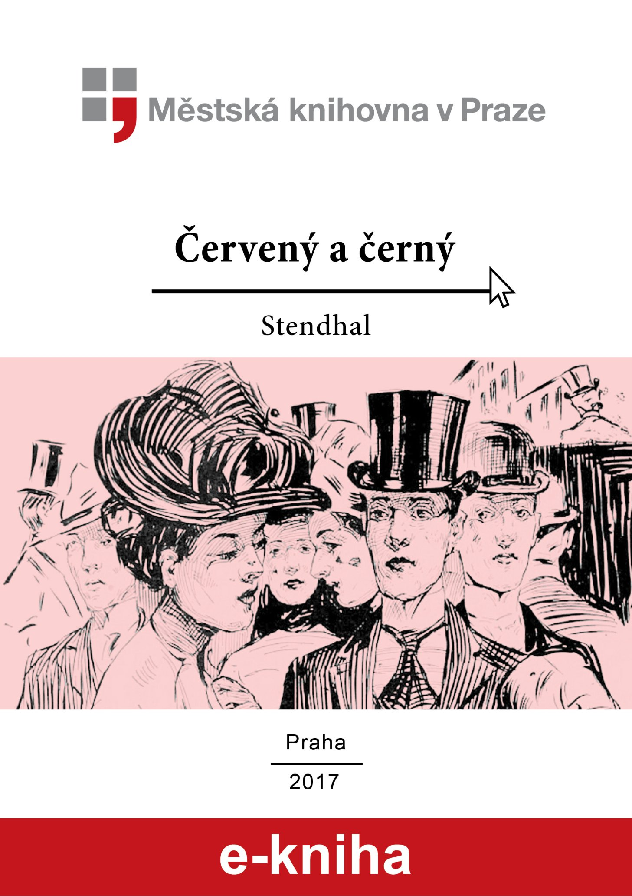

<section>

</section>

[^1]: V mincích po 6 francích.

[^2]: Citáty z Byrona jsou v překladu Pavla Eisnera.

[^3]: Hrdinka veršované povídky ,,Paní z Vergy“ hynoucí v domnění, že ji zradil milenec.

[^4]: Překlad J. V. Sládka.

[^5]: Náboženské spolky služebnictva, jejichž prostřednictvím církev získávala spojence v šlechtických domech.

[^6]: Podívejte se na stranu 130.

[^7]: Věřte mi.

[^8]: Co je psáno, to je dáno.

[^9]: Chytrému napověz.

[^10]: Buď zdráv a miluj mě.

[^11]: Viz v Louvru vévodu Františka Aquitánského, odkládajícího přilbu a beroucího na sebe mnišský hábit, č. 1130 (_pozn. aut._).

[^12]: Francouzská mystička.

[^13]: Venkove, kdy tě spatřím (citát je však z Horatia).

[^14]: Jsem při tobě, je to moje dílo.

[^15]: Proslulý kejklíř (pozn. autora).

[^16]: Rossiniho opera.

[^17]: To mluví nespokojenec (poznámka Molièrova k Tartuffovi). _Pozn. autora._

[^18]: Biskup a ministr narozený v Besançonu.

[^19]: Redaktoři satirického časopisu, uvěznění pro urážku vlády.

[^20]: Musím se potrestat, jestliže jsem příliš milovala.

[^21]: Syn zedníka, který velel části roajalistické armády při vendéském povstání.

[^22]: Slavný kazatel.

[^23]: Jestliže dovolí osud.

[^24]: Od této chvíle již neřeknu ani slovo.

[^25]: Zde mluví z něho jakobín (_Pozn. aut.)._

[^26]: Od La Fontaina; podle nich je „manželský svazek tísnivým ortelem“.
